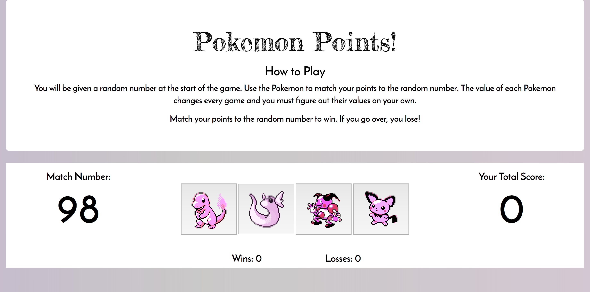

# unit-4-game

# Pokemon Points
A jQuery Guessing Game

### How to Play
You will be given a random number at the start of the game. Use the crystals to match your points to the random number. The value of the crystals changes for every game and you must figure out their values on your own.

Match your points to the random number to win. If you go over, you lose!

### [Play the Game!](https://ragobash.github.io/unit-4-game/)

Technology:
HTML5 | CSS3 | JavaScript | jQuery
Bootstrap | Google Fonts